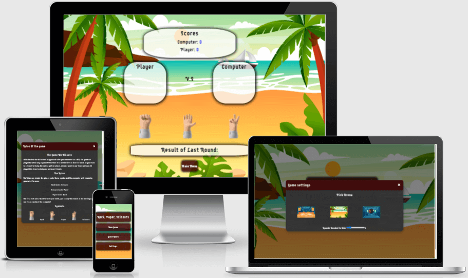

# Rock, Paper, Scissors Game
## Introduction 
The classic school playground game we all played one time as kids, rock, paper, scissor setteled any argument.Play this classic game agenst the computer and see if you got what it takes to win.This game is for anyone looking for a quick 10 minutes of fun or to keep ur kids entertained whilst you do the washing up.

[Link to live site](https://harriss1989.github.io/rock-paper-scissor-game/)

## User Experience (UX)
* User stories
* Visitor Goals
    * When visiting this site, I want to be able to navigate easily, from the main title to the main game and back again.

    * When visiting this site, I want to be able to easily find out about the games and have diffrent level of difficalty.

    * When visiting this site, I would like to find information about the game im plying e.g game rulse 

# Structure
The game site consists of one main page, the player has the option to change arena background and select rounds for a minimum of 3 to a max of 15 giving the player added dificulty.
# Design
The game site design i kept simple, one page that houses all of the game functonallity in a simple easy to use menu. There are three buttons on the main screen telling the user what each button does, i added functions to each of the buttons to bring up the relevent content by useing modals one for new game were the user can enter and submit there name, this will be visable in the game screen, a game rules button to explain the game, a settings button giving the user the option to change the background of the game arena and a round slider to pick how many rounds till the game is over for added difficulty. 
## Google Fonts:
Google fonts were used to import the "Supermercado One" font into the style.css file which is used throughout the Game and gradeintback up of sans-serif. 

# Colour Scheme
### Background svg used
I used svg for background images in the hope to add movment to the game to give the page an added element of fun. This task was a bit more than i can handel at the moment but i have keeped them in a seperate js file so to revisit this at a later date once my skills have improved. 

### Colors used for elements in site

## Balsamiq:
Balsamiq was used to create the wireframes during the design process. I kept to the design throught the project keeping it simple for beter user experiance.

Main Page Wireframe - [View](/assets/wireframes/mainpage.png)

Mobile Wireframe - [View](/assets/wireframes/mobile-main-screen.png)

Settings page Wireframe - [View](/assets/wireframes/settings.png)

Rules page Wireframe - [View](/assets/wireframes/rules.png)

Main game Wireframe - [View](/assets/wireframes/main-game.png)

Winner screen Wireframe - [view](/assets/wireframes/winner-screen.png)

Name entry Wireframe - [view](/assets/wireframes/name-entry.png)
## Features

Heading 
* The main page consists of a main heading simply letting the user know what game they are about to play all the font throught are the same "Supermercado One". I chose this as it felt to me to be retro game font. 

Navigation
* Navigation, the game has a few navigational fetures, three buttons on the main page; New game, Rules and settings. Each button takes the player to its intended modal or game, a hover element is on all of the buttons that help the player visually see which button they are selecting. The settings, game rules and the winner/loser message has a close model function when the player either clicks ouside of the modal or on the x in the top right corner there is also a main menu button on the main game screen to take the player back to reset the game for another try at beating the computer.

player name input modal
* 
Super Mario Main page
* The main page of the site has a hero image Which I use across two of the three pages keeping it familiar to the user. The page also consists of two text fields, the first gives a brief history of where the games started to how they evolved through out the years, whilst the second is a time-line list from the first title in the series to current day. It also states which console those title was realised for.

Characters Page
* The character page has five individual boxes with a little background information, and a list of their strengths and abilities that they are known for throughout the Super Mario Bros series. This is a page viewers can come to learn more about the iconic characters.

Sign Up Page
* The sign-up page has a sign-up box for users to input their information to subscribe for the monthly Super Mario Bros newsletter which is sent out via email. As this is my first project the input does not record any personal information. The newsletter is intended to inform the subscriber of any news and events associated with Super Mario. Once a user inputs their information and hits the 'Here we go' button, they will then be taken to a thank you for signing up page. No newsletter will be sent out as this is for project purposes only.

## Technologies Used

* HTML5
* CSS3

Photos source
 * https://www.vecteezy.com/
 * https://www.istockphoto.com/
 * https://www.pinterest.co.uk/

 To save on file space I ran all photos through https://tinypng.com/
 

## Git
Git was used for version control by utilizing the Gitpod terminal, to commit to Git and Push to GitHub.
## GitHub:
GitHub is used to store the projects code after being pushed from Git.

## Testing
The W3C Markup Validator and W3C CSS Validator Services were used to validate every page of the project to ensure there were no syntax errors in the project.

### Google Chrome Lighthouse Report
* light house report desktop

* light house report mobile

### Validator Reports
* W3C Markup Validatorindex.html - [Results](https://validator.w3.org/nu/?showsource=yes&doc=https%3A%2F%2Fharriss1989.github.io%2FHistory-of-SuperMario%2Findex.html)

* W3C Markup Validator characters.html - [Results](https://validator.w3.org/nu/?doc=https%3A%2F%2Fharriss1989.github.io%2FHistory-of-SuperMario%2Fcharacters.html)

* W3C Markup Validator signup.html - [Results](https://validator.w3.org/nu/?doc=https%3A%2F%2Fharriss1989.github.io%2FHistory-of-SuperMario%2Fsignup.html)

* W3C Markup Validator yoursignedup- [Results](https://validator.w3.org/nu/?doc=https%3A%2F%2Fharriss1989.github.io%2FHistory-of-SuperMario%2Fyoursignedup.html%3Ffname%3Dbenjamin%26lname%3Dharriss%26email%3Dharriss_1%2540hotmail.co.uk)

* W3C CSS Validator - [Results](https://jigsaw.w3.org/css-validator/validator?uri=https%3A%2F%2Fharriss1989.github.io%2FHistory-of-SuperMario%2F&profile=css3svg&usermedium=all&warning=1&vextwarning=&lang=en)

After checking course material I added aria-label to my hero-image and thankyou image, the validator is giving me a warning after talking to my mentor and trying a diffrent aria tag this then gave me a error so i reverted it back to just give a warning.
### Accessibility Report

* Wave Report - [Results](https://wave.webaim.org/report#/https://harriss1989.github.io/History-of-SuperMario/index.html)

# Browsers Tested
* Safari
* Google Chrome
* Microsoft Edge
* Firefox

# Devices Tested
* iPhone Xr 
    * Safari - iOS 14.8.1 
    * Chrome - version 95.0.4638.50
* iPad 7th generation 
    * Safari - iOS 14.8.1
* iPhone 11 
    * Safari - iOS 15.1
* iPhone 11 pro max
    * Safari - iOS 15.1
* Apple MacBook Air 13"
    * Chrome - Version 96.0.4664.55
    * Safari - Version 15.1 (17612.2.9.1.20)
    * Firefox -Version 94.0.2
* Hp Laptop
    * Microsoft Edge - version 96.0.1054.34 

From these test above I ensured all the links and buttons worked correctly. I used the devices listed above to test the deployed site. I also used the devtools emulator to test the site at various sizes. 

# Deployment
* The site was deployed to Github pages.the step to deploy are as follows:
  * In the GitHub pages, navigate to the settings tab
  * select the pages link from the setting menu on the left hand side 
  * Under the GitHub pages from the source section drop-down menu, select the master branch
  * Once the master branch has been selected,the page will be automatically refreshed
  with a detailed ribbon display to indecate the successful deployment.

 [Link to live site](https://harriss1989.github.io/History-of-SuperMario/)
 
# Credits
Media source
 * https://www.vecteezy.com/
 * https://www.istockphoto.com/
 * https://www.pinterest.co.uk/

 The Favicon, links and meta code were generated by [Realfavicongenerator.net](https://realfavicongenerator.net)

 Content
 * I referenced mario.fandome to fact check the information. [mario.fandom.com](https://mario.fandom.com/wiki/MarioWiki)
 * I referred to w3schools to check HTML and CSS syntax.
 * I referred to CSS-Tricks to help me understand flexbox in more detail.

 ### Acknowledgments

 * A massive thank you to Shellie Downie for giving me the pep talk of my life, and for her constant reassurance when I was suffering with imposter syndrome. And for all the links she thought would help me understand more

 * Massive thank you to Matt Boddden who spent a lot of time helping me with positioning my form page correctly and for being a great support when I needed help. (You legend)
 
 * The brilliant Slack community wish I used you sooner.

